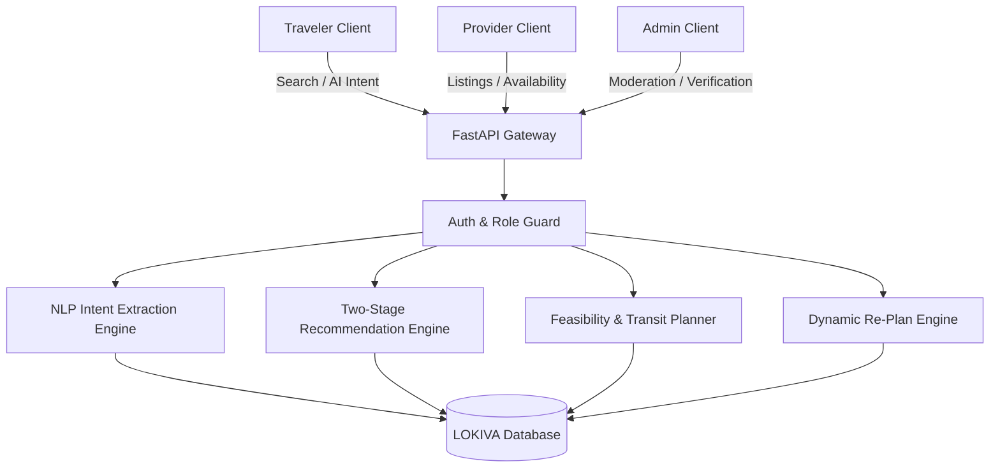

# LOKIVA — Intelligent Local Discovery & Experience Platform

<div align="center">

# LOKIVA
### **Find the place. Feel the local.**

*An AI-powered Pan-India local discovery and experience platform that delivers personalized, feasible itineraries, authentic hidden gems, and dedicated host management.*

[-black?style=flat-square&logo=next.js)](https://nextjs.org/)
[-009688?style=flat-square&logo=fastapi)](https://fastapi.tiangolo.com/)
[](https://tailwindcss.com/)
[](https://www.sqlalchemy.org/)
[-orange?style=flat-square)](https://lokiva.in)

</div>

---

## 📑 Table of Contents
1. [Problem Statement & Vision](#-problem-statement--vision)
2. [Our Solution](#-our-solution)
3. [Key Features](#-key-features)
4. [Pan-India Architecture](#-pan-india-architecture)
5. [Three Dedicated Application Portals](#-three-dedicated-application-portals)
6. [AI Recommendation & Feasibility Engine](#-ai-recommendation--feasibility-engine)
7. [Dynamic Re-Planning Engine](#-dynamic-re-planning-engine)
8. [Interactive Maps & Location Intelligence](#-interactive-maps--location-intelligence)
9. [Technology Stack](#-technology-stack)
10. [System Architecture](#-system-architecture)
11. [Project Directory Structure](#-project-directory-structure)
12. [Database Schema & Data Model](#-database-schema--data-model)
13. [API Reference Summary](#-api-reference-summary)
14. [Environment Variables](#-environment-variables)
15. [Installation & Setup Guide](#-installation--setup-guide)
16. [Demo Accounts (1-Click Login)](#-demo-accounts-1-click-login)
17. [Hackathon Demo Presentation Workflow](#-hackathon-demo-presentation-workflow)
18. [Automated Test Suite & Verification](#-automated-test-suite--verification)
19. [Implementation Status & Roadmap](#-implementation-status--roadmap)
20. [Team & License](#-team--license)

---

## 🎯 Problem Statement & Vision

### The Problem
* **Generic "Top 10" Tourist Traps**: Travelers across India end up at crowded, commercialized tourist spots instead of experiencing authentic culture and regional artisan traditions.
* **Context Blindness**: Existing travel apps ignore critical travel constraints: *"I have elderly parents who cannot walk long distances,"* or *"I have exactly 3 hours between connecting trains with a ₹1,500 budget."*
* **Unfeasible Itineraries**: AI chat tools hallucinate unrealistic timelines, ignoring city traffic, opening hours, local transit auto/cab fares, and rest buffers.
* **Disconnected Local Hosts**: Traditional artisans, pottery studios, family sweetmakers, and heritage walk leaders lack accessible digital platforms to receive real-time bookings.

### Our Vision
**LOKIVA** turns travel discovery into an intelligent, constraint-aware concierge grounded strictly in real database facts across **all of India**.

---

## 💡 Our Solution

LOKIVA connects travelers, local experience providers, and platform administrators through three specialized interfaces powered by an intelligent two-stage recommendation engine and dynamic re-planning:

```
 Natural Language Prompt           Extracted Constraints            Feasible Pan-India Day Plan
("4 hrs in Mumbai, ₹2000,    ──►  [Duration: 240m, Budget: ₹2000, ──► [Kala Ghoda Walk ➔ Irani Chai
  parents, low walking")           Low Walking: True, City: Mumbai]     ➔ Marine Drive Sunset]
```

* **Zero Hallucinations**: Every suggested experience is verified against database opening times, ticket prices, and geographical coordinates.
* **Realistic Transit**: Accounts for inter-stop city transit (auto-rickshaws/cabs/walking), buffer times, and actual costs.
* **Dynamic Hot-Swapping**: One-click adaptation to sudden rain showers, venue capacity limits, or tightened schedules.

---

## ✨ Key Features

| Category | Feature | Description |
| :--- | :--- | :--- |
| 🤖 **AI Intelligence** | **Natural Language NLP Parser** | Extracts time, budget, party size, city, dietary, and accessibility constraints from open conversational text. |
| 🎯 **Recommendation** | **Two-Stage Ranking** | Stage 1 eliminates invalid/closed venues; Stage 2 multi-factor scores for preference, budget, distance, and hidden gem status. |
| 💡 **Explainability** | **"Why This Fits You"** | Transparent, database-grounded explanation bullets detailing exact criteria matches. |
| 🗺️ **Pan-India Reach** | **15 Destination Hubs** | **229 verified experiences** across Maharashtra, Rajasthan, Kerala, Goa, Delhi, Uttar Pradesh, West Bengal, Karnataka, Tamil Nadu, Himachal Pradesh, Uttarakhand, and Punjab. |
| 🛺 **Feasibility** | **Transit & Buffer Engine** | Computes real-world travel times between stops and estimates auto/taxi fares. |
| 🌧️ **Dynamic Re-Planning** | **Real-Time Disruption Recovery** | Hot-swaps exposed outdoor spots with indoor cultural havelis during rain alerts or venue closures. |
| 🏢 **Provider Hub** | **Host Business Suite** | Dedicated portal for artisans and hosts to publish listings, manage slots, view bookings, and analyze earnings. |
| 🛡️ **Admin Portal** | **Platform Governance** | Audit user accounts, approve provider credentials with 1-click verification, and monitor platform GMV. |
| 🎨 **Design System** | **Permanent Dark Mode** | Premium Slate-950 aesthetic with neon orange, emerald, and purple visual accents. |

---

## 🇮🇳 Pan-India Architecture

LOKIVA operates across all major cultural, heritage, and culinary hubs in India:

```
                       ┌──────────────────────────────────────────────┐
                       │           LOKIVA PAN-INDIA HUBS              │
                       ├──────────────────────────────────────────────┤
                       │  • North: Delhi NCR, Jaipur, Udaipur,        │
                       │           Varanasi, Rishikesh, Amritsar,     │
                       │           Shimla/Manali                      │
                       │  • West:  Mumbai, Goa (Panaji/Old Goa)       │
                       │  • South: Fort Kochi, Bengaluru, Chennai,    │
                       │           Hyderabad                          │
                       │  • East:  Kolkata Heritage Precinct          │
                       └──────────────────────────────────────────────┘
```

* **State & City Directory** (`/destinations`): Explore regional hub guides, top neighborhoods, and curated experiences.
* **Dynamic Experience Routes** (`/destination/[state]/[city]`): Dynamic landing pages showcasing city overview, local culture, and experience catalogs.

---

## 👥 Three Dedicated Application Portals

LOKIVA enforces clean role separation. Each persona has its own login portal, dashboard, and navigation:

### 1. Traveler Experience
* **Entry**: `/login/traveler` · `/register/traveler`
* **Navigation**: Explore Catalog (`/explore`), Pan-India Destinations (`/destinations`), AI Concierge (`/ai-guide`), Feasible Itinerary (`/itinerary`), Saved Bucket List (`/saved`), Profile & Mobility Preferences (`/profile`).
* **Accent Theme**: Warm Amber & Orange.

### 2. Experience Provider Portal
* **Entry**: `/login/provider` · `/register/provider`
* **Navigation**: Business Overview (`/provider`), Listings (`/provider/experiences`), Add Experience Creator (`/provider/experiences/new`), Bookings & Guest Manifest (`/provider/bookings`), Slot & Capacity Scheduler (`/provider/availability`), Audience Analytics (`/provider/analytics`), Studio Bio (`/provider/profile`), Payout Settings (`/provider/settings`).
* **Accent Theme**: Electric Blue & Indigo.

### 3. Admin Command Center
* **Entry**: `/login/admin` *(Strictly no public registration)*
* **Navigation**: Platform Governance Overview (`/admin`), User & Host Directory (`/admin/users`), Provider Verification Queue (`/admin/providers`), Catalog Moderation (`/admin/experiences`), Traveler Safety Reports (`/admin/reports`), National Search Analytics (`/admin/analytics`), AI Engine Parameters (`/admin/settings`).
* **Accent Theme**: Royal Purple & Indigo.

---

## 🧠 AI Recommendation & Feasibility Engine

LOKIVA uses a transparent mathematical scoring function:

$$\text{Score} = w_{\text{pref}} S_{\text{pref}} + w_{\text{feas}} S_{\text{feas}} + w_{\text{dist}} S_{\text{dist}} + w_{\text{budget}} S_{\text{budget}} + w_{\text{avail}} S_{\text{avail}} + w_{\text{rating}} S_{\text{rating}} + w_{\text{gem}} S_{\text{gem}}$$

* **Stage 1 (Hard Filtering)**: Removes spots that are closed, outside the specified city, over budget, or fail accessibility requirements (e.g., stairs when *Low Walking* is active).
* **Stage 2 (Scoring & Ranking)**: Weights category alignment, proximity to starting hotel, price-to-budget ratio, rating, and verified hidden gem status.

---

## 🔄 Dynamic Re-Planning Engine

When travel plans face unexpected disruptions, LOKIVA’s **Live Re-Plan Engine** adapts the schedule:

| Scenario | Simulated Disruption | Intelligent Re-Plan Action |
| :--- | :--- | :--- |
| 🌧️ **Rain Alert** | Sudden rain forecast during scheduled outdoor tour | Hot-swaps exposed walking trails with indoor pottery studios or heritage galleries within 2 km. |
| 🚫 **Capacity Limit** | Scheduled workshop reaches maximum capacity | Queries database for the closest verified provider in the same category. |
| ⏱️ **Time Shortened** | Traveler needs to leave 2 hours earlier | Eliminates distant stops, tightens transit intervals, and recalculates timeline. |
| 💰 **Budget Drop** | Traveler reduces budget ceiling | Replaces high-ticket stops with free/low-cost authentic hidden gems. |

---

## 🗺️ Interactive Maps & Location Intelligence

* **Pan-India Vector Map Canvas**: Dynamic vector texture map with adaptive zoom and neighborhood chips.
* **Visual Itinerary Route**: Connected step-by-step route lines connecting Hotel Start ➔ Stop 1 ➔ Stop 2 ➔ Stop 3.
* **Transit Insights**: Displays estimated travel duration and approximate auto-rickshaw / taxi fares for each leg.

---

## 🛠️ Technology Stack

```
┌──────────────────────────────────────────────────────────────────────────┐
│                             FRONTEND                                     │
│  • Framework: Next.js 16 (Turbopack, App Router, React 19)              │
│  • Styling: Tailwind CSS v4 (Custom Dark Mode Variant)                   │
│  • Icons: Lucide React                                                   │
│  • State & Auth: Custom React Context + JWT Token Storage                │
└──────────────────────────────────────────────────────────────────────────┘
                                   │  HTTP / JSON (REST API)
                                   ▼
┌──────────────────────────────────────────────────────────────────────────┐
│                             BACKEND                                      │
│  • Framework: FastAPI (Python 3.11+)                                     │
│  • ORM: SQLAlchemy 2.0                                                   │
│  • Schemas & Validation: Pydantic v2                                     │
│  • Auth & Security: OAuth2 Bearer, Passlib (Bcrypt), Python-JOSE (JWT)   │
│  • Heuristics: Haversine distance, Urban Transit Speed Matrix Heuristics │
└──────────────────────────────────────────────────────────────────────────┘
                                   │  SQL
                                   ▼
┌──────────────────────────────────────────────────────────────────────────┐
│                             DATABASE                                     │
│  • Default Engine: SQLite 3 (lokiva.db) with Zero External Config         │
│  • Production Ready: PostgreSQL / PostGIS Compatible                     │
└──────────────────────────────────────────────────────────────────────────┘
```

---

## 📐 System Architecture



---

## 📂 Project Directory Structure

```
c:\LOKIVA\
├── backend/
│   ├── app/
│   │   ├── api/             # FastAPI Routers (auth, destinations, experiences, etc.)
│   │   ├── core/            # Config, DB connection, JWT & security helpers
│   │   ├── models/          # SQLAlchemy Models (User, State, City, Experience, etc.)
│   │   ├── schemas/         # Pydantic Request & Response Schemas
│   │   ├── services/        # AI NLP extractor, recommendation engine, replan engine
│   │   └── utils/           # Geospatial & transit calculation helpers
│   ├── seed/
│   │   └── seed_data.py     # 229 Pan-India experiences & demo accounts
│   ├── tests/
│   │   ├── verify_pan_india_flow.py      # Automated Pan-India test suite
│   │   └── verify_auth_and_dashboards.py # Automated Persona & Security test suite
│   ├── main.py              # Application entry point
│   └── requirements.txt     # Python backend dependencies
│
├── frontend/
│   ├── app/
│   │   ├── admin/           # Dedicated Admin Governance Pages
│   │   ├── provider/        # Dedicated Provider Business Pages
│   │   ├── login/           # Persona Login Portals (/traveler, /provider, /admin)
│   │   ├── register/        # Persona Registration Portals
│   │   ├── explore/         # Experience Catalog with Filters & Split Map View
│   │   ├── destinations/    # Pan-India State & City Directory
│   │   ├── destination/     # Dynamic [state]/[city] Guide Pages
│   │   ├── ai-guide/        # AI Local Concierge Chat Interface
│   │   ├── itinerary/       # Feasible Itinerary Timeline & Re-Plan Simulator
│   │   ├── saved/           # Traveler Saved Bucket List
│   │   ├── profile/         # Traveler Travel Profile & Preferences
│   │   ├── globals.css      # Tailwind v4 Dark Mode Styling
│   │   ├── layout.tsx       # Root Layout with ThemeProvider & AppHeader
│   │   └── page.tsx         # Pan-India Landing Page
│   ├── components/
│   │   ├── layout/          # TravelerHeader, ProviderHeader, AdminHeader, AppHeader
│   │   ├── ExperienceCard.tsx
│   │   ├── InteractiveMap.tsx
│   │   ├── TimelineView.tsx
│   │   ├── ReplanModal.tsx
│   │   └── RouteGuard.tsx   # Role-based Route Protection
│   ├── lib/
│   │   ├── api.ts           # Type-safe API Client
│   │   ├── auth-context.tsx # Authentication Context & Role Validation
│   │   └── theme-context.tsx# Theme Context (Dark Mode)
│   ├── types/               # TypeScript Definitions
│   └── package.json
│
├── README.md                # Project Documentation
├── DATABASE.md              # Database Schema & Model Reference
└── ARCHITECTURE.md          # Technical Architecture Deep Dive
```

---

## 🗄️ Database Schema & Data Model

LOKIVA uses 9 core relational tables:

```
┌──────────────┐     ┌──────────────┐     ┌──────────────┐
│    states    │───< │    cities    │───< │    areas     │
└──────────────┘     └──────────────┘     └──────────────┘
                                                 │
                                                 ▼
┌──────────────┐     ┌──────────────┐     ┌──────────────┐
│    users     │───< │  providers   │───< │ experiences  │
└──────────────┘     └──────────────┘     └──────────────┘
       │                                         │
       ├───< traveler_profiles                   ├───< reviews
       └───< bookings >──────────────────────────┘
```

* **`states`**: 12 Indian states (Maharashtra, Rajasthan, Kerala, Goa, etc.).
* **`cities`**: 15 major destination hubs with geographic bounding boxes and centroid coordinates.
* **`areas`**: Neighborhoods (e.g., Bandra, Kala Ghoda, Old City Jaipur, Fort Kochi, Anjuna).
* **`users`**: Platform accounts with hashed passwords and role (`traveler`, `provider`, `admin`).
* **`traveler_profiles`**: Mobility constraints, preferred traveler type, default budget.
* **`providers`**: Artisan studio profiles, contact info, ratings, and verification badge.
* **`experiences`**: 229 catalog records with categories, pricing, hours, coordinates, tags, and accessibility flags.
* **`reviews`**: Verified traveler ratings and commentary.
* **`bookings`**: Reservations connecting travelers to provider experiences.

---

## 🔌 API Reference Summary

All API endpoints are served under `/api/v1`:

| Method | Endpoint | Description | Access |
| :--- | :--- | :--- | :--- |
| `POST` | `/api/v1/auth/login` | Authenticate user and return JWT token | Public |
| `POST` | `/api/v1/auth/register` | Register new Traveler or Provider | Public |
| `POST` | `/api/v1/auth/demo-login/{role}` | Instant 1-click demo login | Public |
| `GET` | `/api/v1/destinations` | List all Pan-India destination hubs | Public |
| `GET` | `/api/v1/destinations/states` | List Indian states with experience counts | Public |
| `GET` | `/api/v1/experiences` | Filter experiences by city, category, budget, low walking | Public |
| `POST` | `/api/v1/ai/extract-intent` | NLP parser converting text into structured constraints | Public |
| `POST` | `/api/v1/recommendations` | Two-stage scored recommendations with explainability | Public |
| `POST` | `/api/v1/itineraries/build` | Build sequenced timeline with transit & buffer intervals | Public |
| `POST` | `/api/v1/itineraries/replan` | Execute dynamic re-planning disruption simulation | Public |
| `GET` | `/api/v1/providers/me` | Get active provider business profile | Provider, Admin |
| `GET` | `/api/v1/providers/analytics` | Get views, conversion rates, and gross earnings | Provider, Admin |
| `POST` | `/api/v1/providers/experiences` | Create new provider experience listing | Provider, Admin |
| `GET` | `/api/v1/admin/stats` | Platform GMV, total travelers, active listings | Admin Only |
| `GET` | `/api/v1/admin/providers` | Provider audit and verification queue | Admin Only |
| `PUT` | `/api/v1/admin/providers/{id}/verify` | Grant / revoke verified host badge | Admin Only |

---

## ⚙️ Environment Variables

### Backend (`.env` or system environment):
```ini
PROJECT_NAME="LOKIVA API"
API_V1_STR="/api/v1"
SECRET_KEY="lokiva_super_secret_hackathon_jwt_key_2026"
ACCESS_TOKEN_EXPIRE_MINUTES=10080
DATABASE_URL="sqlite:///./lokiva.db"
DEFAULT_CITY="Mumbai"
DEFAULT_STATE="Maharashtra"
```

### Frontend (`frontend/.env.local`):
```ini
NEXT_PUBLIC_API_URL="http://127.0.0.1:8000/api/v1"
```

---

## 🚀 Installation & Setup Guide

### Prerequisites
* **Python 3.11+**
* **Node.js 18+** & **npm**

### Step 1: Clone Repository
```bash
git clone https://github.com/your-org/lokiva.git
cd lokiva
```

### Step 2: Set Up & Run Backend
```bash
# Install Python dependencies
python -m pip install -r backend/requirements.txt

# Seed the database with 229 Pan-India experiences & demo accounts
python -m backend.seed.seed_data

# Start the FastAPI server
python -m uvicorn backend.main:app --host 0.0.0.0 --port 8000 --reload
```
* Backend API will be live at `http://127.0.0.1:8000`
* Interactive API Documentation (Swagger) at `http://127.0.0.1:8000/docs`

### Step 3: Set Up & Run Frontend
```bash
# In a new terminal:
cd frontend
npm install
npm run dev -- -p 3000
```
* Frontend Application will be live at `http://localhost:3000`

---

## 🔑 Demo Accounts (1-Click Login)

Every login portal includes a **1-Click Demo Login** button for instant demonstration:

| Persona | Demo Email | Demo Password | Default Profile / Role |
| :--- | :--- | :--- | :--- |
| **Traveler** | `traveler@lokiva.demo` *(or `aarav@lokiva.com`)* | `traveler123` | Aarav Sharma (Family · 4 pax · Low Walking · ₹2,000) |
| **Provider** | `provider@lokiva.demo` *(or `provider@lokiva.com`)* | `provider123` | India Artisan Heritage Guild (Verified Host · 284 Reviews) |
| **Admin** | `admin@lokiva.demo` *(or `admin@lokiva.com`)* | `admin123` | LOKIVA Platform Superuser (Root Governance Access) |

---

## 🎬 Hackathon Demo Presentation Workflow

Follow this 5-minute flow for hackathon judges:

1. **Pan-India Landing Page** (`http://localhost:3000`):
   - Show the Pan-India destination hubs (Mumbai, Goa, Jaipur, Fort Kochi, Delhi, Varanasi).
   - Click a quick-prompt chip (e.g. *"Mumbai Food & Culture with Parents under ₹2,000"*).
2. **AI Local Concierge & Explainability** (`/ai-guide`):
   - Demonstrate natural language intent extraction.
   - Click **"View Extracted JSON"** to highlight zero-hallucination constraint extraction.
   - Show the **"Why this fits you"** grounded explanation badges on each recommendation card.
3. **Feasible Day Itinerary & Transit Engine** (`/itinerary`):
   - Show the sequenced timeline with transit time (~15 mins auto-rickshaw, ₹60 estimated fare) and 30-min rest buffers.
   - View the live connected route on the **Interactive Vector Map**.
4. **Live Dynamic Re-Planning** (Click **"Simulate Re-Plan"**):
   - Select **"Simulate Rain Alert"** ➔ Execute.
   - Watch the engine instantly swap outdoor stops for nearby indoor covered workshops while keeping the schedule intact.
5. **Provider Business Hub** (`/login/provider`):
   - 1-Click Login as Provider.
   - Show the host business metrics (Views, Itinerary Adds, Revenue: ₹92,400) and the **New Experience Creator**.
6. **Admin Governance Command Center** (`/login/admin`):
   - 1-Click Login as Admin.
   - Review platform GMV (₹28.4L) and click **"Grant Verified Badge"** in the Provider Verification Queue.

---

## 🧪 Automated Test Suite & Verification

The codebase includes automated test suites covering all core workflows:

```bash
# 1. Test Pan-India Geo Hierarchy & Multi-City Recommendations:
python -m backend.tests.verify_pan_india_flow

# 2. Test Persona Auth, Role Separation & Security 403 Enforcement:
python -m backend.tests.verify_auth_and_dashboards
```

**Verification Results:**
```
==================================================
 LOKIVA: End-to-End Persona & Security Test Suite 
==================================================
[OK] Traveler logged in successfully (Role: traveler)
[OK] Traveler can access experiences catalog
[OK] Security Enforced: Traveler received 403 Forbidden on /api/v1/admin/stats
[OK] Security Enforced: Traveler received 403 Forbidden on /api/v1/providers/experiences
[OK] Provider logged in successfully (Role: provider)
[OK] Provider Profile & Analytics verified
[OK] Security Enforced: Provider received 403 Forbidden on /api/v1/admin/stats
[OK] Admin authenticated successfully (Role: admin)
[OK] Admin verified provider in queue
*** ALL PERSONA AUTHENTICATION & SECURITY TESTS PASSED PERFECTLY! ***
```

---

## 📊 Implementation Status & Roadmap

### ✅ Implemented in Current MVP
- [x] Pan-India Data Model across 15 destination hubs & 229 verified experiences.
- [x] Natural language intent extraction engine with rule-based fallback.
- [x] Two-stage constraint filtering and multi-factor scoring.
- [x] Grounded "Why This Fits You" explainability badges.
- [x] Feasible timeline generation with inter-stop transit & rest buffers.
- [x] Dynamic re-planning simulation (rain alert, sold out, budget drop, shortened time).
- [x] Three isolated application portals for Traveler, Provider, and Admin.
- [x] Role-based route guards and backend API permission enforcement (403).
- [x] Provider business hub (KPIs, listing management, bookings manifest, slot scheduler).
- [x] Admin governance platform (user directory, verification queue, catalog moderation).
- [x] Permanent dark mode theme design system.

### 🔮 Future Scope (Planned)
- [ ] Direct UPI Payment Gateway integration for traveler bookings.
- [ ] Real-time WebSocket notifications for instant host booking alerts.
- [ ] Multi-lingual speech-to-text input (Hindi, Marathi, Bengali, Tamil, Telugu).
- [ ] Native iOS and Android mobile apps using React Native.

---

## 👥 Team & License

* **Project**: LOKIVA — Intelligent Local Discovery & Experience Platform
* **Version**: 1.0.0 (Production-Quality Hackathon MVP)
* **License**: MIT License

---

<div align="center">

**Built with ❤️ for Indian Culture, Heritage Artisans & Curious Travelers.**

</div>
